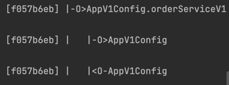

## 프록시 패턴과 데코레이터 패턴

### 시작전 더 나은 이해를 위한 설정
- 인터페이스 구현 클래스 -> 스프링 빈 수동등록
- 인터페이스 없는 클래스 -> 스프링 빈 수동등록
- ComponentScan으로 스프링 빈 자동등록

### 프록시 패턴과 데코레이터 패턴의 차이
- 프록시 패턴 : 접근 제어가 목적 (프록시 패턴 != 프록시)
  - 권한에 따라 접근을 차단 할 수 있다.
  - 캐싱 역할이 가능하다.
  - 지연 로딩을 한다.

- 데코레이터 패턴 : 부가 기능 추가가 목적
  - 원래 서버가 제공하는 기능에 더해서 부가 기능을 수행한다.
  - ex) 로깅

### 인터페이스 기반 프록시와 클래스 기반 프록시

#### 공통점
- 다형성을 적용해서 사용
- 기존 코드(비지니스 로직)를 바꾸지 않고, 부가기능을 추가 가능
- 프록시 클래스를 추가함

#### 차이점
- 클래스 기반 프록시
  - 해당 클래스에서만 적용 가능
  - 부모 클래스의 생성자를 호출해야함(super() 를 통해서)
  - 클래스에 final 붙는다면 상속이 불가능해짐 -> 다형성에 제약
  - 메서드에 final 붙는다면 override 불가능해짐 -> 다형성에 제약

- 인터페이스 기반 프록시
  - 인터페이스만 같다면 모든 곳에 적용 가능 -> 확장에 용이
  - 다만, 인터페이스가 꼭 필요하다. -> 인터페이스가 없으면 애초에 불가
  - 인터페이스가 장점이 많지만, 항상 필요한 것은 아님

### 리플랙션
- 장점 : 클래스와 메서드의 메타정보를 활용해서 애플리케이션을 동적으로 유연하게 사용할 수 있다.
- 단점 : 런타임에 동작한다. -> 컴파일 시점에서 오류를 잡지 못함

### AOP
- pointcut : 필터 역할(적용할 대상을 확인)
- advice : 추가 적용할 로직(부가기능으로 추가할 로직 적용)
- advisor : 하나의 pointcut + 하나의 advise
- proxy에 무조건 advisor 있어야 함
  - 하나의 proxy에 둘 이상의 advisor 가능
  - 여러 advisor가 존재한다 하더라도 여러 proxy가 존재하는 것은 아님
- 탐색 순서
  - 클라이언트 요청 -> 프록시(팩토리) -> pointcut으로 먼저 필터링 -> 적용 대상이면 advice 로직 실행 -> target(비지니스 로직)실행
  - 클라이언트 요청 -> 프록시(팩토리) -> pointcut으로 먼저 필터링 -> 적용 대상이 아님 advice 로직 실행 안함 -> target(비지니스 로직)실행

### 빈 후처리기
- BeanPostProcessor 사용 -> 객체를 스프링 빈에 등록하기전에 조작하는 목적
- 빈 후처리기는 영향력이 강함 -> 객체 조작도 가능하며, 아예 다른 객체로 갈아끼우는 것도 가능
- 기본적인 네 가지 작동과정
  - @Bean, @ComponentScan 통한 빈 생성
  - 빈 후처리기에 전달
  - 빈 후처리기에서 작업(객체 조작 --> 빈 객체를 프록시로 변경)
  - 스프링 빈 저장소에 등록
- 모든 스프링 빈에 적용할 필요는 없기에 프록시 적용 범위를 지정해둔다.

### 스프링이 제공하는 빈 후처리기

- implementation 'org.springframework.boot:spring-boot-starter-aop' 의존성 주입
- AnnotationAwareAspectJAutoProxyCreator(AutoProxyCreator) -> 자동으로 프록시를 생성해주는 빈 후처리기
- advisor 이 포함하는 pointcut 을 통해 스프링 빈에서 프록시 적용 유무를 파악 -> 그 후에 advise 부가기능을 적용
- 자동 프록시 생성기의 여섯 가지 작동과정 
  - @Bean, @ComponentScan 통한 빈 생성
  - 빈 후처리기에 전달
  - 빈 후처리기가 스프링 컨테이너에 모든 빈의 advisor 조회
  - 조회한 advisor의 pointcut을 통해 적용할 대상을 매칭(판단) 후 적용
  - 프록시 생성(하나의 객체 내에 100가지 메소드 중 1개도 없으면 프록시를 생성하지 않음(=원본 객체가 빈으로 등록) 그렇지만, 1개라도 있을 경우 생성)
  - 반한된 객체를 스프링 빈에 등록
- 이름 단위로 프록시 적용을 정하면 스프링에서 애초에 등록할 빈의 이름중에 겹치는게 발생할 수도 있음

- 위의 문제를 해결하기 위해 AspectJExpressionPointcut 사용
  - AspectJExpressionPointcut -> AOP에 특화된 포인트컷 표현식을 적용 가능

### 생각해볼 것
- 프록시는 여러개의 advisor를 가질 수 있는데, 여러개의 advisor에서 pointcut 적용 대상이 된다면, 여러개를 생성하는 것인가? 이렇게 된다면 낭비가 심할 것 -> 하나의 프록시만 생성함. 단지, 여러개의 advisor를 갖는것이지 여러개의 프록시를 생성하는 것은 아니다 !!

### @Aspect 프록시
- 자동 프록시 생성기는 @Aspect를 찾아 advisor로 바꾸고 저장하는 역할도 있음
  - AnnotationAwareAspectJAutoProxyCreator 이름에서 자동 프록시 생성기 앞에 "AnnotationAwareAspectJ"를 통해 유추 가능
- @Aspect를 advisor로 저장하는 과정
  - 스프링 애플리케이션이 실행될 때, 자동 프록시 생성기를 호출
  - 자동 프록시 생성기가 스프링이 관리하는 모든 빈에 조회해서 @Aspect 어노테이션이 붙은 것을 확인
  - @Aspect advisor를 빌더를 통해 @Aspect 어노테이션 기반 advisor를 등록
  - 생성한 advisor를 @Aspect의 advisor빌더 내부에 저장

### 자동프록시 생성기의 역할 두 가지 정리
- advisor 기반으로 프록시 생성 (프록시는 한 객체에 한개만 생성)
- @Aspect를 찾고 advisor로 바꾸어서 저장

### 자동 프록시 생성기의 작동과정 정리